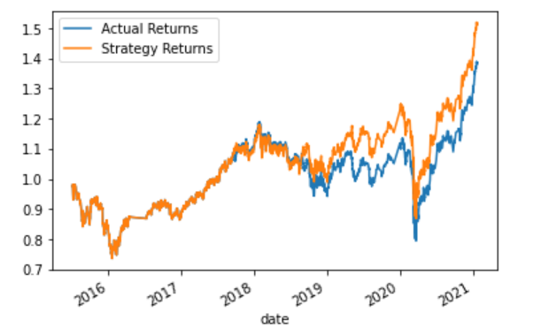
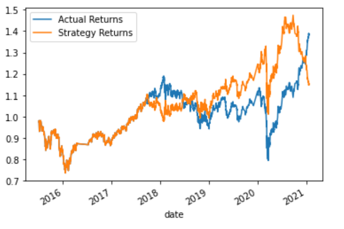

# Module14Challenge
Algorithmic Trading (Optimization via Machine Learning Algorithms)

## Technologies

This project leverages jupyterlab version 3.2.1.

## Usage

Ensure the conda dev environment is activated.

Using CLI, please launch the jupyter lab. Please open the machine_learning_trading_bot.ipynb. 

## Overview of the Analysis

We were tasked to use a dataset (ohlcv data) of emerging markets to implement an algorithmic trading strategy (baseline) that uses machine learning to automate the trade decisions, then adjust the input parameters to optimize the trading algorithm and finally train a new machine learning model and compare its performance to that of a baseline model. We performed the analysis in following three steps:   

#### 1) Baseline Performance

A cumulative return plot (showing the actual returns vs. strategy returns) is shown below.

Based on the plot above the SKLearn's support vector machine (SVM) model does a great job in predicting the returns. The two curves follow each other w.r.t. returns.

#### 2) New Machine Learning Classifier (using the original data)

A new classifier (LogisticRegression) was chosen and the original training data from the baseline model was used.
A cumulative return plot (showing the actual returns vs. strategy returns) is shown below (LogisticRegression).

Based on the plot above the Logistic Regression model does not do a good job as compared to the SVM model (based on the original data). This is particularly evident from the time periods of middle of 2018 and also towards the end of 2020.
