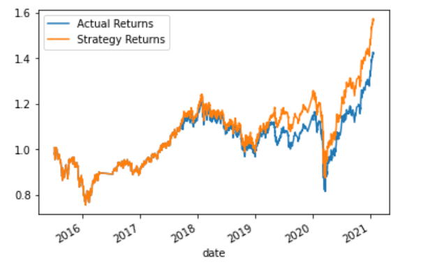

# Module14Challenge
Algorithmic Trading (Optimization via Machine Learning Algorithms)

## Technologies

This project leverages jupyterlab version 3.2.1.

## Usage

Ensure the conda dev environment is activated.

Using CLI, please launch the jupyter lab. Please open the machine_learning_trading_bot.ipynb. This file is saved with the baseline trading algorithm.

## Overview of the Analysis

We were tasked to use a dataset (ohlcv data) of emerging markets to implement an algorithmic trading strategy (baseline) that uses machine learning to automate the trade decisions, then adjust the input parameters to optimize the trading algorithm and finally train a new machine learning model and compare its performance to that of a baseline model. We performed the analysis in following three steps:   

#### 1) Baseline Performance

A cumulative return plot (showing the actual returns vs. strategy returns) is shown below.

Based on the plot above the SKLearn's support vector machine (SVM) model does a great job in predicting the returns. The two curves follow each other w.r.t. returns.

#### 2) New Machine Learning Classifier (using the original data)

A new classifier (LogisticRegression) was chosen and the original training data from the baseline model was used.
A cumulative return plot (showing the actual returns vs. strategy returns) is shown below (LogisticRegression).

Based on the plot above the Logistic Regression model does not do a good job as compared to the SVM model (based on the original data). This is particularly evident from the time periods of middle of 2018 and also towards the end of 2020. The accuracy score is also lower at 0.52.

Again, LogisticRegression model perfoms worse compared to the tuned trading algorithm.

#### 3) Tune the Baseline Trading Algorithm

##### a) Adjusting the size of training set
Baseline Training Dataset = 3 months

Training Dataset changed to 2 months: Although the strategy returns try to match with the actual returns towards the end of 2020 we lose the overlap of the curves reduces during end of 2017 to end of 2019. The accuracy score is 0.55.

Training Dataset changed to 1 months: There is a distinct gap between the strategy returns and the actual returns throughout the dataset. The accuracy score is 0.55. So we concur that using the training dataset of 1 month is not a viable option.

Training Dataset changed to 4 months: The strategy returns try to match with the actual returns towards the end of 2020 however the strategy returns score lower than the actual returns from late 2018 to early 2020 as compared to the baseline model. The accuracy score is 0.55.

Training Dataset changed to 5 months: The strategy returns try to match with the actual returns towards the end of 2020 however the strategy returns score lower than the actual returns from late 2018 to early 2020 as compared to the baseline model. The accuracy score improves to 0.56.

Overall, decreasing the trading window is giving higher strategy returns than the actual returns whereas increasing the trading window is giving lower strategy returns than the actual returns. The accuracy scores variations are insignificant however we sacrifice the the curve overlaps. In view of above observations trading windows of 2 , 3 and 4 show small variations so the decision is to keep the trading window at 3 months.

##### b) Adjusting the SMA input features
Baseline: Short_Window = 4 & Long_Window = 100

Short_Window is changed to 3 days: No significant changes observed. The accuracy score stays at 0.55.

Short_Window is changed to 5 days: The strategy returns and actual returns curves follow each other very closely. The accuracy score improves to 0.56.

Short_Window is changed to 6, 7 days: The strategy returns and actual returns curves follow each other for majority of the dataset but the strategy returns are lower than the actual returns in 2020. The accuracy score also improves to 0.56.

Long_Window is changed to 50, 75 and 80 days: The strategy returns are lower than the actual returns and the accuracy scores also scores lower.

Long_Window is changed to 105 days: The strategy returns are slightly better than the actual returns as compared to the baseline case. The accuracy score also stays at 0.56.

Long_Window is changed to 110, 115 and 120 days: The strategy returns are lower than the actual returns and the accuracy scores also scores lower.

Overall, as seen from above increasing or decreasing the SMA windows the strategy returns tend to follow the actual returns for majority of the dataset but the strategy returns tend to be lower. The best strategy returns were found at long_window = 105 days and the accuracy score improved to 0.56.

##### c) Set of Parameters (that best improved the trading algorithm returns)
Based on the above findings a) and b) following parameters were set that best improved the trading algorithms.  
trading window = 3 months   
short_window = 4 days   
long_window = 105 days   

As seen from the plot above the strategy returns have improved over the actual returns after setting the new parameters as compared to the baseline model. The accuracy score improved to 0.56 as compared to 0.55 in baseline model. The strategy returns show slight increase to 1.6 % compared to 1.5 % as seen in the basline model.

